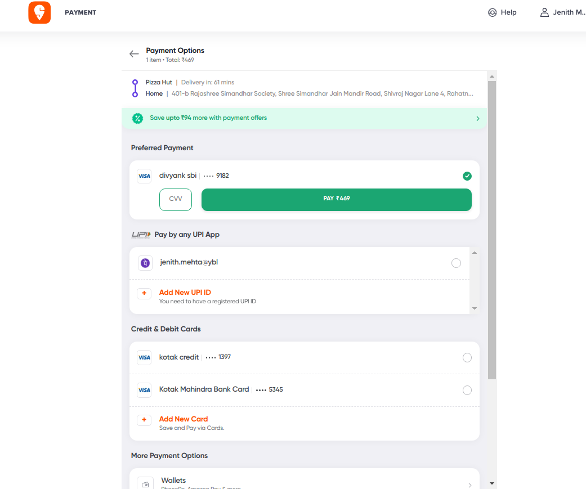

### TODO:

- make a payment page similar to swiggy or zomato
  

- there should be debit credit card options
- each app when opened should have options to add credit debit details
- there should be UPI options
- once whichever option is selected, the user should be directed to appropriate gateway
- how to design backend code for saving credit debit card info
- how to integrate payment gateway appropriately
- how to design frontend?

  - I think I should pickup some opensource frontend design and try to impliment using vanilla html, css and js

- eta?
  - backend 4hrs
  - frontend 4-5 hrs
